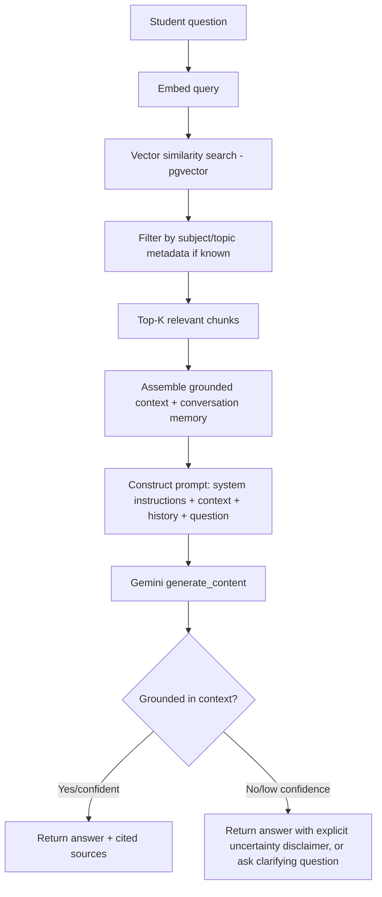

# AI Architecture — AI Tutor

## 1. Goals & Constraints

The AI Tutor must act as a trustworthy ZIMSEC STEM tutor: explain concepts, show full workings for Mathematics, connect Science explanations to syllabus topics, generate quizzes/exercises/study plans, and **never invent facts** — every substantive answer must be grounded in retrieved curriculum material where possible, with explicit uncertainty when it isn't.

None of the three analyzed sibling repos (`hanna`, `Kali-Safaris`, `sungrip-chatbot`) have a working RAG/multi-turn-memory system — this is the one component built genuinely new for this platform, though the Gemini *call pattern* (strict JSON output + defensive parsing) is reused from `hanna/email_integration/tasks.py`.

## 2. Gemini Integration

- **Client**: `google-genai` SDK, wrapped in a thin `GeminiProvider` class (provider-agnostic interface) so the model/vendor can change without touching `ai_tutor` business logic.
- **Credential management**: reuse the `AIProvider` DB-model pattern (active-provider-per-type, rate-limit tracking) from `Kali-Safaris`/`hanna`, with the API key field **encrypted at rest** (fixing the plaintext weakness found in hanna).
- **Model selection**: `gemini-2.5-flash` (or current equivalent) for latency-sensitive chat/quiz generation; a higher-capability model reserved for harder structured/essay-question generation if flash-tier quality is insufficient — configurable per task type, not hardcoded.
- **Structured output**: prompts that need machine-parseable results (quiz generation, grading, topic classification) request strict JSON via response schema / prompt constraints, parsed with a robust JSON extractor + structural validator (ported pattern from `hanna`), so malformed LLM output fails safely instead of crashing a flow.

## 3. RAG Workflow

**Ingestion pipeline** (Celery tasks, triggered on content create/update):
1. New/updated `PastPaper`, `MarkingScheme`, `Note`, or curriculum document → text extraction (PDF text layer; OCR via `pytesseract`/`pdf2image` fallback for scanned papers, reusing the pattern present in `hanna`/`Kali-Safaris`).
2. Chunking (semantic/paragraph-based, ~300–800 tokens with overlap).
3. Embedding generation (Gemini embedding model) → stored as `Embedding` rows (pgvector) linked to `KnowledgeDocument`.
4. Re-ingestion on content edit (versioned, old embeddings invalidated).

## 4. Knowledge Base Design

- **Sources**: Past Papers + Marking Schemes (primary source of "what ZIMSEC actually asks/expects"), Revision Notes, Curriculum/syllabus documents, Question Bank (explanations).
- **Metadata per chunk**: `subject_id`, `topic_id` (nullable), `source_type` (`paper`, `marking_scheme`, `note`, `curriculum`, `question`), `year` (for papers), enabling filtered retrieval (e.g. "only Physics, only Mechanics topic").
- **Retrieval strategy**: hybrid — metadata pre-filter (subject/topic, if inferable from conversation context) + vector similarity, top-K (e.g. 5–8 chunks), reranked by recency/relevance for past papers (prefer recent syllabus versions).

## 5. Memory Strategy

- **Short-term (turn-level)**: last N messages of the current `AISession`/`Conversation`, stored in Postgres, cached in Redis for the active session — passed verbatim into the prompt.
- **Long-term (cross-session)**: on session end, a summarization task condenses the session into `AISession.memory_summary` (JSON: topics discussed, identified weak areas, recurring mistakes) — injected as a compact system-context block in future sessions instead of full history, keeping prompt size bounded as usage grows.
- **Channel continuity**: memory is keyed by `user_id`, not channel, so a student moving between WhatsApp and the web app gets continuity.

## 6. Prompt Strategy

- **System prompt** establishes persona ("ZIMSEC STEM tutor"), syllabus scope, and hard rules: show full workings for Math, cite sources when available, say "I'm not certain" rather than guess, never answer outside STEM/ZIMSEC scope.
- **Task-specific prompt templates** (Jinja2, matching the templating approach already used in the flow engines of `Kali-Safaris`/`sungrip-chatbot`) for: concept explanation, step-by-step problem solving, mistake identification ("here's where this went wrong"), quiz generation, study plan generation.
- **Tool-calling / agent pattern**: the tutor is modeled as an agent that first classifies intent (explain / solve / generate-quiz / build-plan / general-chat) then invokes the matching tool:
  - `search_knowledge_base(query, subject, topic)` — RAG retrieval
  - `generate_quiz(subject, topic, difficulty, count)` — delegates to Quiz Service
  - `build_study_plan(subjects, exam_date)` — delegates to Study Plan Service
  - `solve_step_by_step(problem, subject)` — math/science structured solving, still RAG-grounded for syllabus alignment
  - This mirrors the pluggable-action registry pattern (`@register_flow_action`) found in the sibling repos' flow engines, applied to AI tool calls instead of conversation steps.

## 7. Hallucination Prevention

- RAG is **mandatory before generation** for any factual/syllabus claim — the agent does not answer cold from model weights alone when a knowledge-base lookup is feasible.
- Responses include a `sources` list (note/paper IDs) whenever grounded; the frontend/WhatsApp reply surfaces "based on: <topic note>" when available.
- A confidence signal (derived from retrieval relevance scores + an explicit self-check prompt step) determines whether to answer directly, hedge, or ask a clarifying question.
- Out-of-scope questions (non-STEM, non-ZIMSEC) are declined with a redirect to supported subjects, rather than answered.
- All AI Tutor exchanges are logged (`Message`/`AISession`) for later audit/QA sampling — flagged answers (low confidence, user-reported "wrong") feed a review queue for content/prompt improvement.

## 8. Scaling & Cost Controls

- Per-user/per-day rate limits on AI Tutor endpoints (DRF throttling) tied to Gemini quota/cost.
- Dedicated Celery queue (`cpu_heavy`/`ai`, per the queue-topology pattern from `Kali-Safaris`) isolates slow Gemini calls from WhatsApp message-sending and flow-logic queues.
- Caching: identical/near-identical question+context pairs (e.g. common quiz explanation requests) can be cache-assisted to reduce redundant Gemini calls, evaluated post-launch based on observed query patterns.
