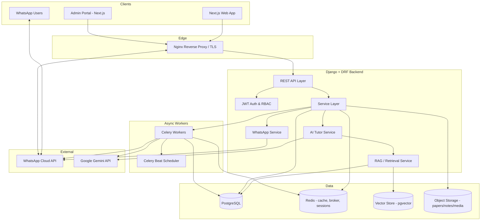
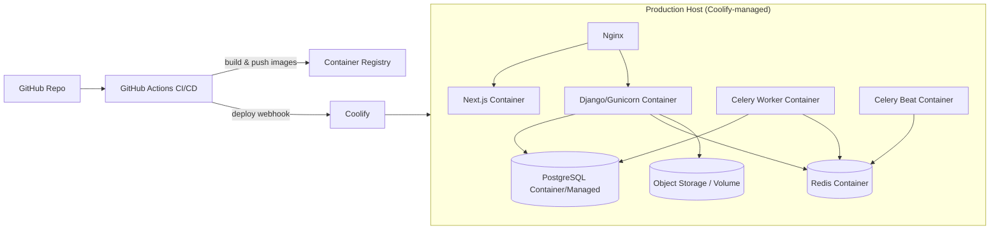
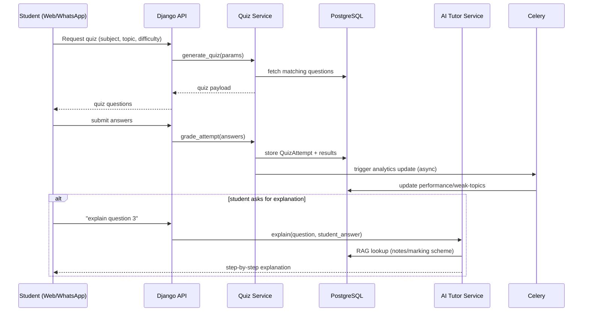

# Architecture — ZIMSEC STEM Revision Platform

## 1. Overview

The platform is a multi-channel education product: a Django/DRF backend serving both a Next.js web application and a WhatsApp chatbot, with an AI Tutor (Google Gemini + RAG) available on both channels. The system must scale to thousands of concurrent students and support new subjects/content without code changes.

## 2. System Architecture



## 3. Service Architecture (Modular Django Apps)

Each domain is an isolated Django app communicating through a service layer (no cross-app model imports outside of FK references), so subjects/content can be extended via data, not code.

```
backend/
├── config/                 # settings, urls, celery app, wsgi/asgi
├── apps/
│   ├── accounts/            # users, student profiles, JWT auth, RBAC
│   ├── subjects/             # subjects, topics, subtopics (data-driven taxonomy)
│   ├── papers/                # past papers, marking schemes
│   ├── notes/                  # revision notes, diagrams/images
│   ├── questions/               # question bank (MCQ, structured, essay, practical)
│   ├── quizzes/                   # quiz engine, attempts, scoring
│   ├── study_plans/                # study plans, sessions, scheduling
│   ├── analytics/                   # performance tracking, recommendations
│   ├── ai_tutor/                     # Gemini integration, agent orchestration, prompts
│   ├── knowledge_base/                # documents, embeddings, RAG retrieval
│   ├── whatsapp/                       # webhook, message router, conversation state
│   ├── conversations/                   # shared conversation/message models (web+WA)
│   ├── files/                             # secure upload/storage abstraction
│   └── audit/                              # audit logs, request/event logging
└── common/                  # shared base models, permissions, pagination, exceptions
```

**Design rules:**
- Subjects/Topics/Subtopics are rows in the database, editable from the admin portal — no hardcoded subject logic. Tier (1/2/3) is a field, not a code branch.
- Each app exposes a `services.py` with the business logic; views/serializers stay thin.
- Cross-channel reuse: `whatsapp` and the public API both call the same `ai_tutor`, `quizzes`, `study_plans` services — channel-specific code only formats input/output.

## 4. AI Architecture (Summary — see AI_ARCHITECTURE.md for detail)

- **Agent-based orchestration**: a tutor "agent" decides intent (explain concept / solve problem / generate quiz / build study plan) and calls tools (knowledge base search, quiz generator, calculator/step-solver, study-plan builder).
- **RAG-first**: every tutor response is grounded by a retrieval step against the knowledge base (past papers, marking schemes, notes, curriculum) before generation.
- **Memory**: short-term (current conversation, Redis-backed) + long-term (per-student summarized history in Postgres) passed into the prompt.
- **Gemini** is called through a thin provider-agnostic client so the model can be swapped without touching business logic.

## 5. WhatsApp Architecture (Summary — see WHATSAPP_FLOWS.md for detail)

- Single webhook endpoint (`/api/whatsapp/webhook/`) verifies signature, enqueues the inbound message to Celery, returns 200 immediately (Meta requires fast ACK).
- A `whatsapp` app stores per-user **conversation state** (current menu/flow position) in Redis, with Postgres as the durable fallback.
- A state-machine based message router maps state + input → next state + response, delegating to the same services used by the web app (papers, notes, quizzes, ai_tutor, study_plans, analytics).
- Outbound messages (replies, quiz questions, proactive nudges) are sent via Celery tasks calling the WhatsApp Cloud API, with retry/backoff.

## 6. Deployment Architecture



- **CI**: GitHub Actions runs lint, type-check, unit/integration tests, builds Docker images on PR merge to `main`.
- **CD**: Coolify watches `main` (or a deploy tag) and redeploys via webhook; database migrations run as a release step before traffic switches.
- **Environments**: `dev` (local docker-compose), `staging`, `production` — same images, different env vars/secrets.

## 7. Data Flow — Student Quiz Attempt (example)



## 8. Scalability Considerations

- Stateless Django app servers behind Nginx → horizontal scaling.
- Redis for caching hot reads (subject/topic trees, quiz question pools) and as Celery broker/session store.
- Celery workers scaled independently for: WhatsApp message processing, AI/Gemini calls (rate-limited queue), analytics aggregation, file processing.
- Read-heavy endpoints (past papers, notes browsing) cached at the API layer and served via CDN for static files (PDFs/images) from object storage.
- Database: connection pooling (pgbouncer), indexes on filterable fields (subject, topic, year, difficulty), read replicas considered post-launch if needed.

## 9. Security Architecture

- JWT access/refresh tokens; refresh rotation; short-lived access tokens.
- RBAC roles: `student`, `content_admin`, `superadmin`, `support`.
- Rate limiting at Nginx + DRF throttling (per-user and per-IP), especially on AI Tutor and auth endpoints.
- WhatsApp webhook signature verification (Meta `X-Hub-Signature-256`).
- All secrets via environment variables / Coolify secret store — never committed.
- Audit log app records sensitive actions (content changes, admin logins, data exports).
