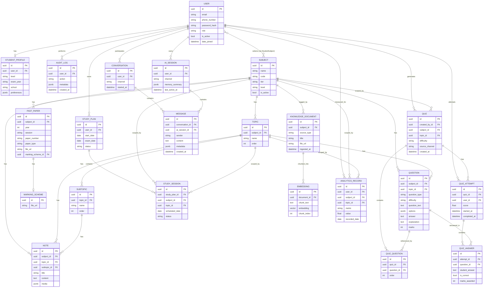

# Database Design — ZIMSEC STEM Revision Platform

PostgreSQL is the system of record. `pgvector` extension is used for embeddings (no separate vector DB needed at launch scale).

## 1. Entity Relationship Diagram

## 2. Model Notes

- **User / StudentProfile**: `User` is the auth model (email or phone login, JWT). `StudentProfile` is 1:1, holds level (O-Level/A-Level), exam year, school. `role` field drives RBAC (`student`, `content_admin`, `superadmin`, `support`).
- **Subject / Topic / Subtopic**: pure data — `tier` (1/2/3) and `is_active` let new subjects go live without a deploy. This is the mechanism satisfying "add subjects without code changes."
- **PastPaper / MarkingScheme**: files stored in object storage; DB holds metadata + URL/key. Indexed on `(subject_id, year, paper_type)` for fast filtering.
- **Note**: supports topic or subtopic granularity (both FKs nullable, at least one required — enforced at the service layer). `media` is a JSON list of image/diagram URLs.
- **Question**: `question_type` enum (`mcq`, `structured`, `essay`, `practical`); `options` JSON for MCQ; `answer`/`explanation` always present for instant marking.
- **Quiz / QuizQuestion / QuizAttempt / QuizAnswer**: `Quiz` is a generated instance (ephemeral definition); `QuizAttempt` is the scored run. Denormalized `score` on attempt for fast leaderboards/analytics; `QuizAnswer` rows are the source of truth for per-question correctness used by weak-topic detection.
- **StudyPlan / StudySession**: plan is the container (start date → exam date); sessions are daily/topic-scoped goals with `status` (`pending`, `done`, `skipped`).
- **Conversation / Message**: channel-agnostic (`web`, `whatsapp`) chat log, shared by AI Tutor and (optionally) human support.
- **AISession**: holds the *summarized* long-term memory (`memory_summary` JSON) per user+channel so prompts don't replay full history; `Message` rows with `ai_session_id` set are the AI Tutor's turn-by-turn record, distinct from generic `Conversation` messages if needed, or unified — final call left to implementation, modeled here as compatible with either.
- **KnowledgeDocument / Embedding**: ingestion pipeline writes one `KnowledgeDocument` per source file (past paper, marking scheme, note, curriculum doc) and N `Embedding` chunks (pgvector `vector` column) per document for RAG retrieval.
- **AnalyticsRecord**: one row per (user, subject, topic, metric, date) — e.g. `metric='topic_accuracy'`. Aggregated by Celery Beat tasks rather than computed on read, for dashboard performance.
- **AuditLog**: append-only, indexed on `(user_id, created_at)` and `action`.

## 3. Indexing Strategy

| Table | Index | Reason |
|---|---|---|
| `past_paper` | `(subject_id, year, paper_type)` | Browse/filter by subject+year is the primary access pattern |
| `note` | `(subject_id, topic_id, subtopic_id)` | Topic navigation |
| `question` | `(subject_id, topic_id, difficulty, question_type)` | Quiz generation query |
| `quiz_attempt` | `(user_id, quiz_id)`, `(user_id, completed_at)` | Progress/history lookups |
| `analytics_record` | `(user_id, subject_id, topic_id, recorded_date)` | Dashboard + weak-topic queries |
| `message` | `(conversation_id, created_at)`, `(ai_session_id, created_at)` | Chat history pagination |
| `embedding` | pgvector HNSW/IVFFlat index on `embedding` | Similarity search for RAG |
| `audit_log` | `(user_id, created_at)` | Compliance queries |

All FK columns get a btree index by default (Django auto-creates these); the table above lists *additional* composite indexes.

## 4. Scaling Considerations

- **Read-heavy tables** (`subject`, `topic`, `subtopic`, `question`, `note`) are small relative to write-heavy ones (`message`, `quiz_attempt`, `analytics_record`) — cache the former in Redis, let the latter scale on Postgres directly with partitioning by date considered post-launch (`message`, `analytics_record`) if volume warrants.
- **Embeddings**: pgvector is sufficient through tens of millions of chunks with HNSW indexing; migrate to a dedicated vector DB (e.g. Qdrant/pgvector-scale) only if RAG latency becomes a bottleneck at scale.
- **Connection pooling** via pgbouncer once Celery workers + Gunicorn workers exceed Postgres `max_connections` comfortably.
- **Soft deletes / archiving**: `quiz_attempt`, `message`, `audit_log` should support archiving older rows to cold storage once retention policy is defined, rather than unbounded growth.
