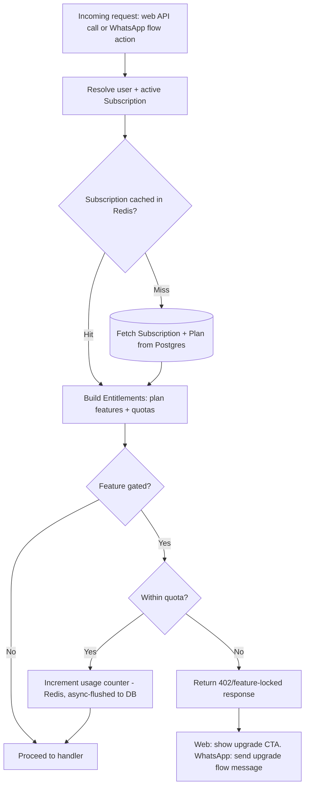
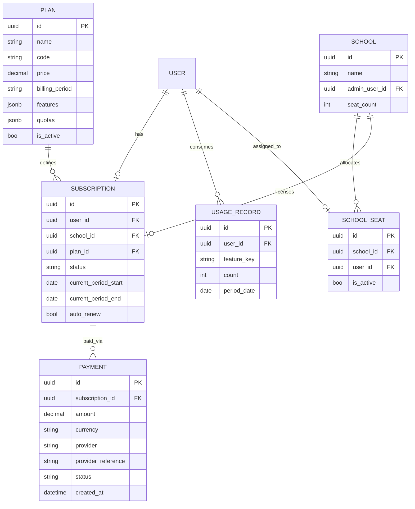

# Monetization & Access Gating — ZIMSEC STEM Revision Platform

## 1. Business Model Overview

The platform follows a **freemium model**: free access drives adoption (critical for a student-facing product in a price-sensitive market), with paid tiers unlocking depth (unlimited practice, AI tutoring, analytics) and an institutional tier for schools. Monetization must not block the platform's core social value — basic past papers and notes browsing stay free indefinitely.

**Revenue streams**:
1. **Student subscriptions** (monthly/termly/annual) — individual paid tiers.
2. **Institutional licenses** — schools/tutoring centres pay per-seat or flat-fee for bulk student access + a teacher/admin dashboard.
3. **Pay-per-feature top-ups** — e.g. one-off AI Tutor credit packs for free-tier students who hit their quota without subscribing.
4. (Future) **Sponsored content** — exam-board-aligned partners sponsoring specific subject content, kept clearly separated from tutoring/AI answers to avoid bias.

## 2. Pricing Tiers

| Tier | Price point (indicative) | Target user |
|---|---|---|
| **Free** | $0 | All students — acquisition/retention funnel |
| **Plus** | Low monthly fee (e.g. $1–3/mo equivalent in local currency / EcoCash) | Individual students wanting full practice access |
| **Premium** | Higher monthly/termly fee | Students wanting full AI Tutor access + analytics |
| **School** | Per-seat or flat institutional fee, billed termly/annually | Schools, tutoring colleges, NGOs sponsoring student access |

Exact price points are a product/finance decision, not an engineering one — the architecture below treats price as configuration (a `Plan` record), not code.

## 3. Feature Gating Matrix

| Feature | Free | Plus | Premium | School (per seat) |
|---|---|---|---|---|
| Browse subjects/topics | ✅ | ✅ | ✅ | ✅ |
| Past papers — view | ✅ (limited count/month) | ✅ unlimited | ✅ unlimited | ✅ unlimited |
| Past papers — download | ❌ or limited | ✅ | ✅ | ✅ |
| Revision notes | ✅ (limited topics) | ✅ unlimited | ✅ unlimited | ✅ unlimited |
| Practice quizzes | ✅ (N/day quota) | ✅ unlimited | ✅ unlimited | ✅ unlimited |
| AI Tutor | ✅ (N messages/day, low quota) | ✅ (higher quota) | ✅ unlimited/high quota | ✅ unlimited |
| Study plans | ✅ basic | ✅ | ✅ full + AI-personalized | ✅ |
| Analytics & weak-topic detection | ✅ basic | ✅ | ✅ advanced (trends, recommendations) | ✅ + class-level analytics for teachers |
| WhatsApp access | ✅ all tiers | ✅ | ✅ | ✅ |
| Teacher/admin dashboard (class progress) | — | — | — | ✅ |
| Ads / promotional content | Possible on Free only | None | None | None |

Quotas (e.g. "5 AI Tutor messages/day on Free") are configuration values per `Plan`, not hardcoded constants, so they can be tuned without a deploy.

## 4. Gating Architecture

Gating must work identically across **web and WhatsApp** — both channels call the same service layer, so access control lives in one place: a `billing` app + a shared `AccessGate` service, not duplicated per-channel checks.



**Implementation notes**:
- `AccessGate.check(user, feature_key)` is the single entry point, called as a DRF permission class on the web API and as a step-guard inside the WhatsApp flow engine (a `@register_flow_action`-style gate action, consistent with the pluggable-action pattern in `WHATSAPP_FLOWS.md`/`AI_ARCHITECTURE.md`).
- **Entitlements are cached** (Redis, short TTL) per user since gating runs on the hot path of nearly every request — avoids a DB round-trip per check.
- **Usage quotas** (daily/monthly counters: AI Tutor messages, quiz attempts, paper downloads) are tracked in Redis for speed and periodically flushed/reconciled to Postgres (`UsageRecord`) for billing/analytics accuracy — same pattern as the analytics aggregation jobs in `DATABASE.md`.
- **Grace handling**: expired subscriptions don't hard-cut access mid-session; a short grace period (configurable) avoids abrupt disruption during payment retries (common with mobile money).
- **Feature flags vs. plan features**: plan-feature mapping lives in `Plan.features` (JSON) so admins can adjust entitlements per plan from the admin portal without a code change — mirrors the data-driven Subject/Tier approach already used for content.

## 5. Database Additions



- **`Plan`**: data-driven pricing/entitlements (`features` and `quotas` as JSON), editable from the admin portal — new tiers or quota changes need no deploy.
- **`Subscription`**: belongs to either an individual `User` or a `School` (institutional); `status` (`active`, `past_due`, `cancelled`, `grace`).
- **`Payment`**: one row per payment attempt/transaction; `provider` (`paynow`, `ecocash`, `card`, etc.), `provider_reference` for reconciliation/webhooks.
- **`UsageRecord`**: daily/monthly counters per user+feature, the durable counterpart to the Redis quota counters.
- **`School` / `SchoolSeat`**: institutional licensing — a school admin manages seat assignment to students under one subscription.

## 6. Payment Integration

Reuse the **Paynow** integration pattern already present in `hanna` and `Kali-Safaris` (per `REPOSITORY_ANALYSIS.md`) — both repos use the `paynow` Python package for Zimbabwean mobile money (EcoCash, OneMoney) and card payments, which is the dominant payment method for this market.

- **`billing` app** wraps Paynow (and leaves room for a second provider) behind a `PaymentProvider` interface, mirroring the `AIProvider`/`MetaAppConfig` DB-driven-credential pattern from the sibling repos — provider keys stored encrypted, active-provider selection without redeploy.
- **Flow**: student selects a plan → `Payment` created (`pending`) → redirect (web) or WhatsApp payment prompt (USSD push via Paynow's mobile money API) → Paynow webhook confirms → `Payment.status = 'paid'` → `Subscription` activated/extended. Webhook handling follows the same idempotent `update_or_create`-on-event pattern used for the WhatsApp webhook (`WHATSAPP_FLOWS.md`).
- **WhatsApp upgrade flow**: triggered by `DENY` in the gating flowchart above — sends a short upgrade menu (plan options) → on selection, initiates a Paynow mobile money push → confirmation message once the webhook lands.

## 7. API Additions

| Method | Endpoint | Description |
|---|---|---|
| GET | `/billing/plans/` | List active plans (public) |
| GET | `/billing/subscription/` | Current user's subscription + entitlements |
| POST | `/billing/subscribe/` | Start a subscription/payment for a plan |
| POST | `/billing/webhook/paynow/` | Paynow payment confirmation webhook (signature-verified, not JWT) |
| POST | `/billing/cancel/` | Cancel auto-renew |
| GET | `/billing/usage/` | Current usage vs. quota for gated features |
| POST | `/schools/` | Create a school (institutional onboarding, admin-only) |
| POST | `/schools/{id}/seats/` | Assign/revoke a student seat |
| GET | `/schools/{id}/analytics/` | Class-level performance analytics (School tier) |

Gated endpoints (e.g. `/ai-tutor/sessions/{id}/messages/`, `/papers/{id}/download/`) return a uniform `402 Payment Required`-style error envelope when quota/plan checks fail:
```json
{ "error": { "code": "feature_locked", "message": "Daily AI Tutor limit reached on Free plan", "upgrade_url": "/billing/plans/" } }
```

## 8. Roadmap Impact

Monetization is sequenced as **Phase 7.5 — Monetization & Gating**, after Analytics (Phase 7) and before Production Hardening (Phase 8), since gating needs the feature surface (quizzes, AI Tutor, papers) to already exist before it can wrap it. See `ROADMAP.md` for the updated phase listing.

**Deliverables**: `billing` app, `Plan`/`Subscription`/`Payment`/`UsageRecord`/`School` models, `AccessGate` service + DRF permission integration, WhatsApp gating action + upgrade flow, Paynow integration, admin portal plan management UI, school onboarding flow.

**Risks**: Payment provider reliability/webhook delivery (mitigate with reconciliation job re-checking pending payments); mobile-money UX friction (test the WhatsApp upgrade flow with real EcoCash/OneMoney prompts early); pricing sensitivity in the target market (keep Free tier genuinely useful to avoid alienating users before monetization design is validated).

**Estimated Effort**: 2–3 weeks.
