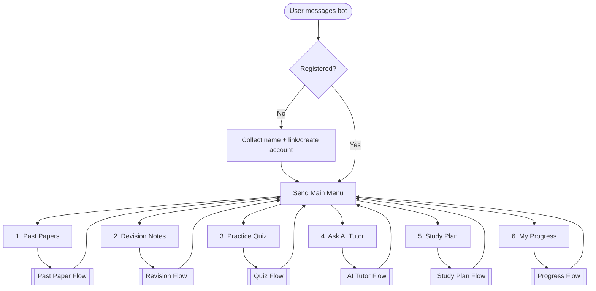
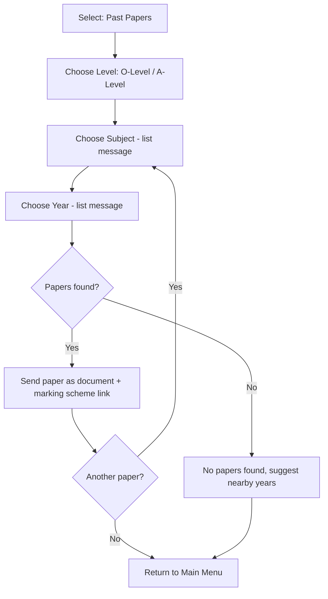
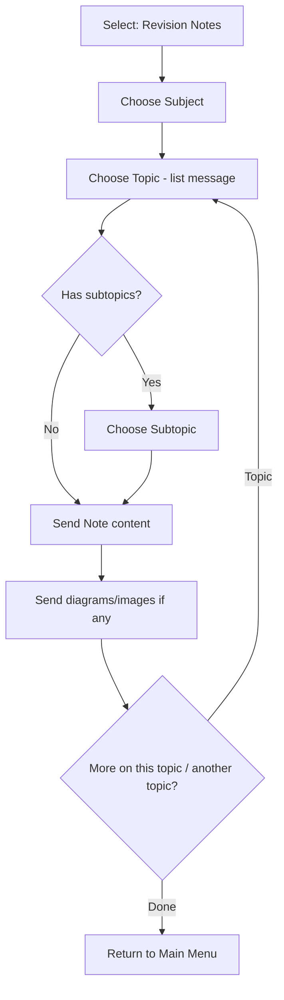
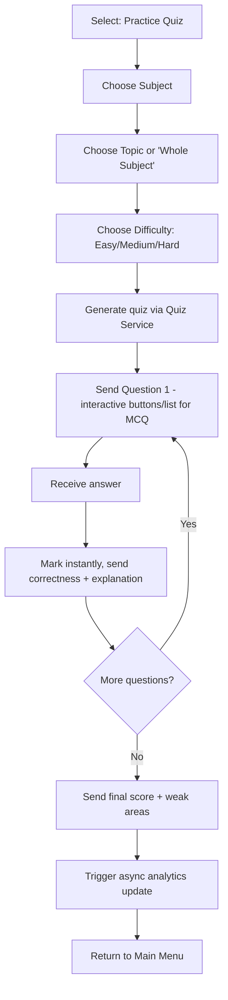
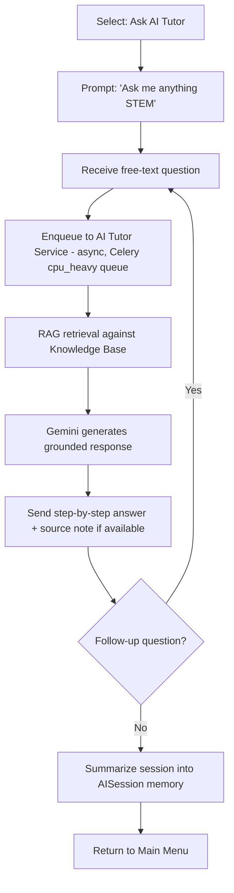
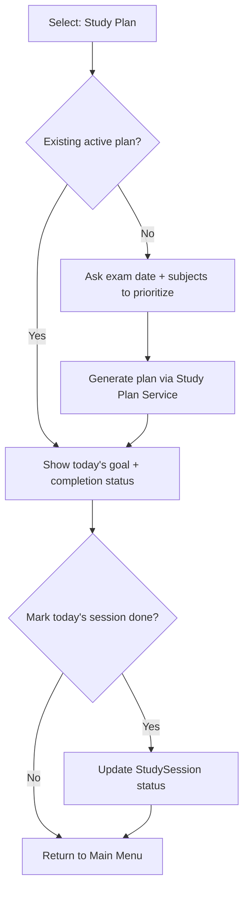
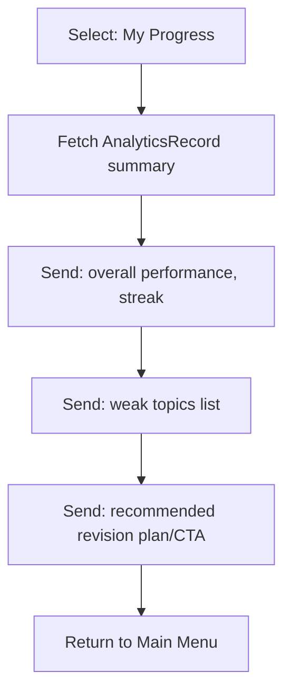

# WhatsApp Assistant — Conversation Flows

All flows are driven by a DB-backed state machine (`whatsapp.ConversationState`: current flow, current step, context JSON), modeled after the `flows`/`FlowSession` pattern found in `Kali-Safaris` and `sungrip-chatbot` (see `REPOSITORY_ANALYSIS.md`). Every flow ultimately calls the same backend services used by the web API — WhatsApp is just another channel.

## 1. Main Menu Flow

## 2. Past Paper Flow

## 3. Revision Flow

## 4. Quiz Flow

## 5. AI Tutor Flow

**Note**: because Gemini calls are slow, the webhook ACKs Meta immediately and the reply is sent as a follow-up outbound message once generation completes (matches the async-dispatch pattern used in all three reference repos).

## 6. Study Plan Flow

Daily goals are also pushed **proactively** via a Celery Beat task (opt-in reminder) rather than only on-demand.

## 7. Progress Flow

## 8. Cross-Cutting Behavior

- **Timeout/abandonment**: if no reply within N minutes mid-flow, state resets to Main Menu on next message (context preserved for resumption where sensible, e.g. quiz progress saved).
- **Global commands**: `menu`/`0` always returns to Main Menu from any step; `help` sends usage instructions.
- **Media**: papers/marking schemes sent as WhatsApp `document` messages; notes' diagrams sent as `image` messages; quiz MCQs use `interactive list/button` messages where option count allows (≤3 buttons / ≤10 list items per Meta limits), falling back to numbered text for larger option sets.
- **Idempotency**: inbound webhook events are deduplicated by Meta `message_id` before flow processing (per the `WebhookEventLog`/`update_or_create` pattern from `hanna`/`Kali-Safaris`).
